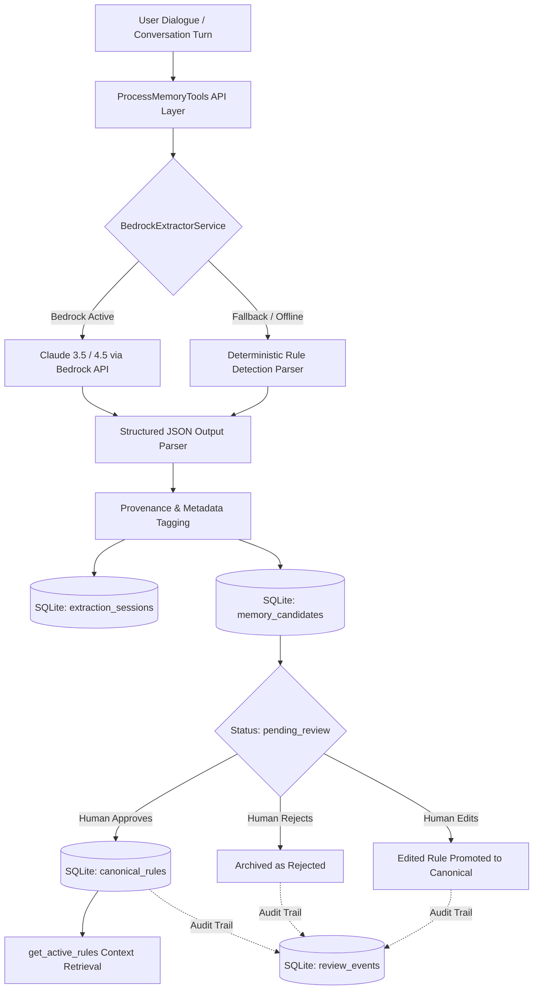

# Process Memory & Context Gateway for ERP (Odoo)

[](https://www.python.org/downloads/)
[](https://opensource.org/licenses/MIT)
[](https://aws.amazon.com/bedrock/)
[](https://docs.pydantic.dev/)

An enterprise-grade **Process Memory & Context Gateway** middleware designed to bridge conversational AI agents with ERP systems (Odoo). 

It continuously extracts tacit and explicit operational business rules from dialogue, maintains end-to-end extraction provenance, enforces strict multi-tenant governance with human-in-the-loop sign-off, and guarantees zero leakage of unapproved policies.

---

## Key Features

- **Automated Memory Extraction:** Inactive & conversational dialogue is parsed into structured, typed business policies using **Amazon Bedrock (Claude 3.5 / 4.5)** with automated fallback to a local deterministic extraction parser.
- **Strict Governance Lifecycle:** Inferred rules land in a staged `pending_review` state. Only human-approved rules are promoted to canonical memory.
- **Immutable Audit Trail:** Append-only event store recording every review decision (approve, reject, edit, supersede) with reviewer identity and timestamps.
- **Rule Versioning:** Canonical rules feature built-in versioning (`v1` &rarr; `v2` with `superseded` pointers) to prevent stale rule enforcement.
- **Multi-Tenant Isolation:** Multi-client architecture with isolated candidate inboxes, process scopes, and active policy sets.
- **Universal Tool API:** Standard 4-tool interface ready for MCP (Model Context Protocol) integration.

---

## System Architecture



---

## Core Toolset

| Tool Name | Method Signature | Purpose |
| :--- | :--- | :--- |
| `extract_memory_candidates` | `(interaction_text, client_id, process_name)` | Analyzes dialogue, attaches source quote & confidence, stages candidates as `pending_review`. |
| `get_candidate_rules` | `(client_id, status='pending_review')` | Surfaces staged candidate rules awaiting human review. |
| `review_candidate_rule` | `(candidate_id, decision, reviewer, ...)` | Processes human sign-off (`approve`, `reject`, `edit`), promotes to canonical `v1`, logs audit event. |
| `get_active_rules` | `(client_id, process_name)` | Returns active canonical rules for policy enforcement. **Guarantees 0 unapproved leakage.** |

---

## Quick Start

### 1. Installation

```bash
git clone https://github.com/OC-jzambrano/process-memory-gateway.git
cd process-memory-gateway
pip install -r requirements.txt
```

### 2. Configuration

Copy the example environment configuration:

```bash
cp .env.example .env
```

Edit `.env` with your AWS Bedrock credentials:

```env
AWS_REGION=eu-north-1
AWS_ACCESS_KEY_ID=your_aws_access_key_id
AWS_SECRET_ACCESS_KEY=your_aws_secret_access_key
BEDROCK_MODEL_ID=eu.anthropic.claude-haiku-4-5-20251001-v1:0
```

### 3. Run Automated Tests

```bash
pytest tests/
```

### 4. Run Interactive Demo

```bash
python run_demo.py
```

---

## Project Structure

```
odoo-process-memory/
├── src/
│   ├── config.py                 # Environment & model settings (reads .env)
│   ├── models/
│   │   ├── enums.py              # RuleType, Severity, RuleStatus, EnforcementMode
│   │   └── schemas.py            # Pydantic domain models
│   ├── storage/
│   │   ├── db.py                 # SQLite schema with 6 relational tables & foreign keys
│   │   └── repository.py         # MemoryRepository (CRUD, isolation, versioning, audit)
│   ├── extractor/
│   │   ├── prompt.py             # XML injection-hardened extraction prompts
│   │   └── service.py            # Bedrock Claude invocation & structured parser
│   └── api/
│       └── memory_tools.py       # 4 Core governance tools
├── tests/
│   ├── test_schema.py            # Relational tables & foreign key validation
│   ├── test_isolation.py         # Isolation gate validation (pending rules non-enforcing)
│   ├── test_provenance.py        # Verbatim quote & confidence validation
│   ├── test_review_flow.py       # Approve / Reject / Edit / Versioning lifecycle tests
│   └── test_extractor.py         # End-to-end extraction tests
├── run_demo.py                   # Interactive demo CLI
├── requirements.txt              # Project dependencies
├── .env.example                  # Environment template
└── .gitignore                    # Secrets & local DB protection
```

---

## License

This project is licensed under the MIT License - see the [LICENSE](LICENSE) file for details.
