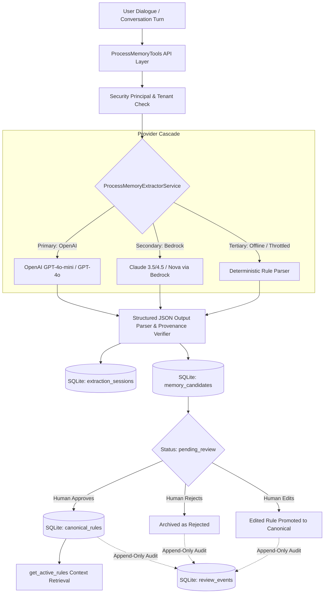

# Process Memory & Context Gateway for ERP (Odoo)

[](https://www.python.org/downloads/)
[](LICENSE)
[](https://platform.openai.com/)
[](https://aws.amazon.com/bedrock/)
[](https://docs.pydantic.dev/)

An enterprise-grade **Process Memory & Context Gateway** middleware designed to bridge conversational AI agents with ERP systems (Odoo). 

It continuously extracts tacit and explicit operational business rules from dialogue, maintains end-to-end extraction provenance, enforces strict multi-tenant governance with human-in-the-loop sign-off, and guarantees zero leakage of unapproved policies.

---

## Key Features

- **Multi-Provider LLM Strategy:** Pluggable provider interface supporting **direct OpenAI API (`gpt-4o-mini`, `gpt-4o`)**, **Amazon Bedrock (Claude 3.5 / 4.5, Amazon Nova)**, and **Deterministic Local Fallback**. Switching providers is pure configuration via `.env` (`LLM_PROVIDER=openai|bedrock|auto|local`).
- **Resilient Cascade Architecture:**
  - `Application` &rarr; `Direct OpenAI API` &rarr; `AWS Bedrock` &rarr; `Local Fallback`
- **Strict Governance Lifecycle:** Inferred rules land in a staged `pending_review` state. Only human-approved rules are promoted to canonical memory. Replay attacks and duplicate promotions are prevented at the database constraint level.
- **Append-Only Immutable Audit Trail:** Database triggers strictly prevent `UPDATE` or `DELETE` on the `review_events` table, creating a tamper-evident audit history.
- **Rule Versioning:** Canonical rules feature atomic versioning (`v1` &rarr; `v2` with `superseded` pointers) to prevent stale rule enforcement or divergent branching.
- **Tenant Authorization & Security Principal:** Every operation requires tenant validation via authenticated `Principal` context, preventing cross-tenant policy access or session hijacking.
- **PII & Credential Redaction:** Pre-transmission redaction utility to mask credit cards, API keys, emails, and phone numbers before cloud LLM ingestion.
- **Universal Tool API:** Standard 4-tool interface ready for MCP (Model Context Protocol) integration.

---

## System Architecture



---

## Core Toolset

| Tool Name | Method Signature | Purpose |
| :--- | :--- | :--- |
| `extract_memory_candidates` | `(interaction_text, client_id, process_name, principal)` | Analyzes dialogue, validates verbatim quote, stages candidates as `pending_review`. |
| `get_candidate_rules` | `(client_id, status='pending_review', principal)` | Surfaces staged candidate rules awaiting human review for the tenant. |
| `review_candidate_rule` | `(candidate_id, decision, reviewer, client_id, principal, ...)` | Processes human sign-off (`approve`, `reject`, `edit`), promotes to canonical `v1`, logs immutable audit event. |
| `get_active_rules` | `(client_id, process_name, principal)` | Returns active canonical rules for policy enforcement. **Guarantees 0 unapproved leakage.** |

---

## Quick Start

### 1. Installation

```bash
git clone https://github.com/OC-jzambrano/process-memory-gateway.git
cd process-memory-gateway
pip install -r requirements.txt
```

### 2. Configuration

Copy the example environment configuration:

```bash
cp .env.example .env
```

Configure your provider in `.env`:

```env
# Provider strategy: "openai", "bedrock", "auto", "local"
LLM_PROVIDER=openai

# OpenAI API Key (Direct API)
OPENAI_API_KEY=sk-...
OPENAI_MODEL_ID=gpt-4o-mini

# AWS Bedrock Settings (Optional / Secondary)
AWS_REGION=eu-north-1
AWS_ACCESS_KEY_ID=AKIA...
AWS_SECRET_ACCESS_KEY=...
BEDROCK_MODEL_ID=eu.anthropic.claude-haiku-4-5-20251001-v1:0
```

### 3. Run Automated Tests

```bash
# Run 82 offline tests (runs in ~1 second, zero cloud network calls):
pytest -m "not ai" -v

# Run with test coverage report:
pytest -m "not ai" --cov=src --cov-report=term-missing

# Run full suite including live cloud AI benchmarks (requires live API key):
pytest -v
```

### 4. Run Interactive Demo

```bash
python run_demo.py
```

---

## Project Structure

```
process-memory-gateway/
├── src/
│   ├── config.py                 # Environment & model settings (reads .env)
│   ├── models/
│   │   ├── enums.py              # RuleType, Severity, RuleStatus, LLMProviderType, ExtractionMode
│   │   └── schemas.py            # Pydantic models (Principal, CandidateRule, CanonicalRule, etc.)
│   ├── storage/
│   │   ├── db.py                 # SQLite schema with composite FKs, WAL mode, immutability triggers
│   │   └── repository.py         # MemoryRepository (atomic state transitions, tenant isolation, audit)
│   ├── extractor/
│   │   ├── prompt.py             # XML injection-hardened extraction prompts with sanitization
│   │   ├── service.py            # Multi-provider cascade orchestrator
│   │   └── providers/            # Pluggable LLM provider implementations
│   │       ├── base.py           # BaseLLMProvider interface
│   │       ├── openai_provider.py# Direct OpenAI API adapter
│   │       ├── bedrock_provider.py# AWS Bedrock adapter with model fallback
│   │       └── fallback_provider.py# Local deterministic heuristic parser
│   ├── utils/
│   │   └── privacy.py            # PII & secret credential redaction utility
│   └── api/
│       └── memory_tools.py       # 4 Core MCP-ready governance tools with Principal auth
├── tests/
│   ├── conftest.py               # Shared test fixtures & deterministic test mode
│   ├── unit/                     # Layer 1: Pure logic tests (schemas, enums, cleaner, privacy)
│   ├── integration/              # Layer 2: Real SQLite DB & atomic state transition tests
│   ├── contract/                 # Layer 3: MCP tool signatures, resilience, & security tests
│   ├── e2e/                      # Layer 4: Full lifecycle workflow tests
│   ├── regression/               # Layer 5 & 6: Pinned golden outputs & AI extraction benchmarks
│   └── fixtures/                 # Sample dialogues & golden expected JSON files
├── run_demo.py                   # Interactive CLI demonstration
├── requirements.txt              # Pinned project dependencies
├── .env.example                  # Environment template
└── LICENSE                       # Apache 2.0 License
```

---

## License

This project is licensed under the Apache 2.0 License - see the [LICENSE](LICENSE) file for details.
